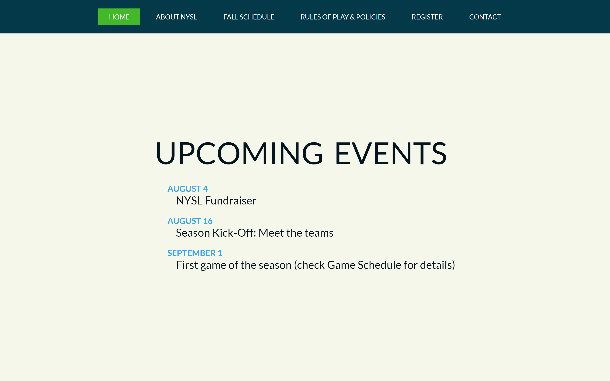

# 👩‍💻 Coding Bootcamp

## 1. Introduction to Website Development

+ Create an initial website mockup. 
+ Add style to the website with CSS.
+ Present data in lists and tables.
+ Add forms and maps.

[Live demo](https://amansgz.github.io/static_website3/)

